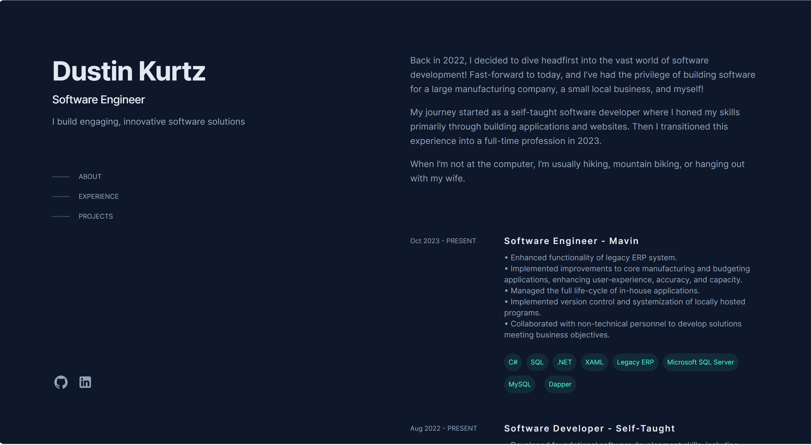

# Table of contents

- [Overview](#overview)
  - [The challenge](#the-challenge)
  - [Screenshot](#screenshot)
  - [Links](#links)
- [My process](#my-process)
  - [Built with](#built-with)
- [Author](#author)
- [Acknowledgments](#acknowledgments)

# Overview

## The challenge

This is my personal porfolio website. It showcases my background, experience, and projects.

## Screenshot

## Links

- Live Site URL: [DustinKurtz](https://www.d-kurtz.com/)

# My process

## Built with

- Typescript
- Tailwind
- Mobile-first workflow
- [React](https://reactjs.org/) - JS library
- [Next.js](https://nextjs.org/) - React framework

## Author

- Github - [Dustin-11](https://github.com/Dustin-11)
- Frontend Mentor - [dustin-kurtz11](https://www.linkedin.com/in/dustin-kurtz11/)

# Acknowledgments
I would like to recognize Britanny Chiang for the design that she created through Figma. I saw her personal portfolio design and used it for inspiration.
